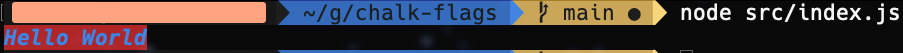

# Collection of Bugs for ChalkFlags

#### 03/09/2022
---
- [ ] When pure invalid flags are entered into the correct syntax, ChalkFlags will trimmed string without the hypothetical flag block and end block
-  \
is correlated to \
 
---
- [ ] (Unsure) All text colors resolve to white if text modifications (such as bold, italics, etc.) are applied concurrently (probably an issue with the lexer/parsing or with the lexer system overriding previous lexers).
    - (3/10/2021) - This issue seems to be happening on certain terminals (during the test I was using the gnome-terminal) and it seemed to have disappeared when I used my mac with the Mac Terminal.
    - ;
        - ``rBg+bb+ii+b/Hello World/end``
    - Though I am inexperienced with the dealing of colors in terminals, I believe the MacOS terminal has greater color support compared to the gnome-terminal.
---

#### 3/10/2022
---
- [ ] When the ``bt`` flag is attached to a ``bg`` flag, it will not parse correctly.