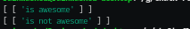
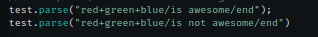

# Collection of Bugs for ChalkFlags

#### 03/09/2021
- [ ] When pure invalid flags are entered into the correct syntax, ChalkFlags will trimmed string without the hypothetical flag block and end block
-  \
is correlated to \
